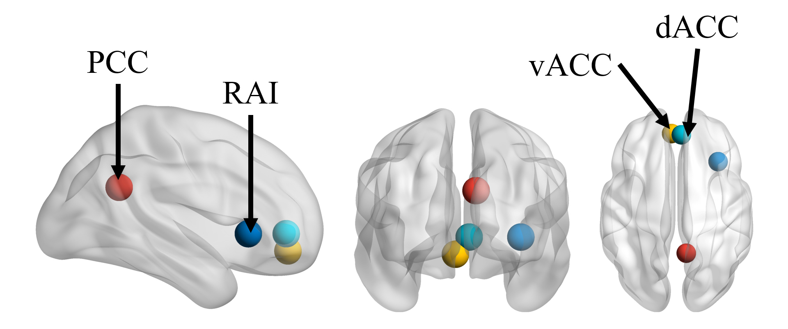

```{r setup, include=FALSE}
knitr::opts_chunk$set(echo = FALSE)
```

<style>
#main-img-left, #main-img-center, #main-img-right {
 width: 3%;
}
</style>


# INTRODUCTION

Meditation is a family of practices that constitutes a variety of cognitive processes embedded in a complex context that contribute to mental states along well-defined phenomenological dimensions [@Lutz2015] 

Important neural markers of meditation training include the right anterior insula (RAI), dorsal cingulate cortex , subgenual anterior cingulate cortex (sgACC) and posterior cingulate cortex (PCC) [@Tang2015].

There is a lack of evidence on the effective connectivity (i.e., causal mechanisms) underlying brain changes in meditation practices.

**OBJECTIVE**  
investigate effective connectivity (EC) changes of the ACCs, PCC, and RAI after a short-term meditation training using spectral dynamic causal modeling (spDCM)


# METHODS

**PARTICIPANTS**  
1. 55 healthy undergraduates without any meditation experience were randomized into either the Integrative Body-Mind Training (IBMT) or Relaxation Training (RT)  
2. Participants completed four weeks of training, 30 minutes each for 20 sessiosn (10 hours total)  

**IBMT & RT**  
1. IBMT involves several body-mind techniques, including (1) body relaxation, (2) breath adjustment, (3) mental imagery, (4) mindfulness   
2. RT involves relaxing different muscle groups over the face, head, shoulders, arms, legs, chest, back, and so on.  

**NEUROIMAGING PROCEDURE & ANALYSIS**  

Resting-state fMRI (rsfMRI) scans were taken a week before and after the intervention, and standard preprocessing steps were taken  

ROIs were defined from previous studies: PCC (8, -53, 27), vACC (-4, 45, -10), RAI (34, 22, 0), and dACC (4, 44, 0) [in MNI coordinates]     

<center></center>
*Figure 1*

Exploratory approach tp spDCM: fully connected two-state model specified to mimic organization of real cortical hierarchies  

Hierachical Parametric Empirical Bayes (PEBs) were used to estimate group*time differences in the EC

# RESULTS


<center></center>
*Figure 2*

RT involves mostly unidirectional excitatory connections (Figure 2A) while IBMT involves bidirectional changes. Furthermore, there were more excitatory input to the RAI while lesser excitatory output from the RAI.

<center></center>
*Figure 3*

After training, IBMT had less excitatory connections fom the vACC to AI at PP > 0.75. At a lower threshold (PP > 0.70), there is additional EC differences: 1) less excitatory connections from the PCC to RAI, and 2) more excitatory connections from the dACC to RAI.

    

# DISCUSSION 


**Bidirectional loop in IBMT suggests the dynamic role of regulation found in IBMT but not in RT.**  

* RAI and PCC suggest consistent updating in the system with regards to attentional focus [@Brewer2011]  
* RAI and ACC informs self-regulation [@Tang2017]  

**Distinct role of the vACC and AI**  

* RT: activation of parasympathetic nervous system [@Palomero2019]    
* IBMT: decoupling when resolving and regulating the acute emotional response to stress [@Shao2018]  

**Click here to chat with me online on Zoom during the OHBM conference!!**


# REFERENCES

